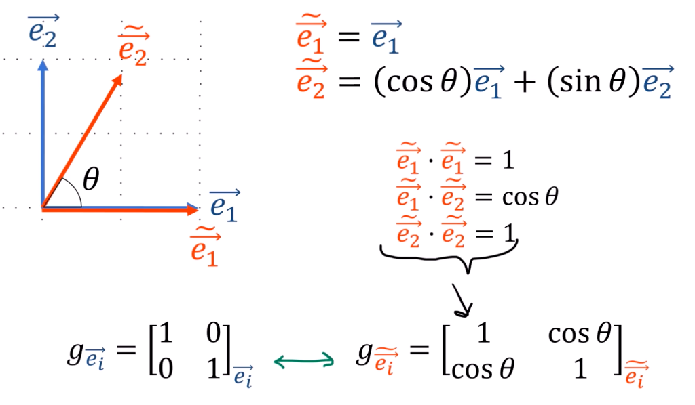
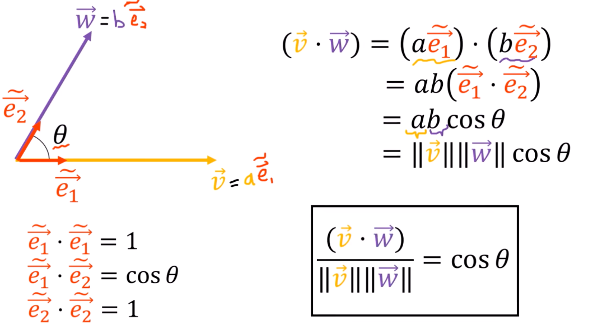

11、度量张量(度规张量)
===================================

广义向量长度
------------------------------------

.. math::

   \|\textcolor{orange}{\vec{v}}\|^2 = \textcolor{orange}{\vec{v}} \cdot \textcolor{orange}{\vec{v}}

表示方式，其中 :math:`\vec{e}_i \cdot \vec{e}_j = \delta_{ij}` ：

.. math::
    :nowrap:

    \begin{aligned}
    \|\vec{v}\|^2 &= (v^1 \vec{e}_1 + v^2 \vec{e}_2) \cdot (v^1 \vec{e}_1 + v^2 \vec{e}_2) \\
    &= v^1 v^1 (\vec{e}_1 \cdot \vec{e}_1) + v^1 v^2 (\vec{e}_1 \cdot \vec{e}_2) + v^2 v^1 (\vec{e}_2 \cdot \vec{e}_1) + v^2 v^2 (\vec{e}_2 \cdot \vec{e}_2) \\
    &= (v^1)^2 (\vec{e}_1 \cdot \vec{e}_1) + 2 v^1 v^2 (\vec{e}_1 \cdot \vec{e}_2) + (v^2)^2 (\vec{e}_2 \cdot \vec{e}_2) \\
    &= (\widetilde{v}^1)^2 (\widetilde{\vec{e}}_1 \cdot \widetilde{\vec{e}}_1) + 2 \widetilde{v}^1 \widetilde{v}^2 (\widetilde{\vec{e}}_1 \cdot \widetilde{\vec{e}}_2) + (\widetilde{v}^2)^2 (\widetilde{\vec{e}}_2 \cdot \widetilde{\vec{e}}_2)
    \end{aligned}

度量张量
------------------------------------

张量是在坐标变换下保持不变的对象，其分量在坐标变换下会以某种特定的可预测方式变化

度量张量能帮我们度量空间中的长度和角度

.. math::

   g_{\vec{e}_i} = \begin{bmatrix} \vec{e}_1 \cdot \vec{e}_1 & \vec{e}_1 \cdot \vec{e}_2 \\ \vec{e}_2 \cdot \vec{e}_1 & \vec{e}_2 \cdot \vec{e}_2 \end{bmatrix}_{\vec{e}_i}

.. math::

   g_{\widetilde{\vec{e}}_i} = \begin{bmatrix} \widetilde{\vec{e}}_1 \cdot \widetilde{\vec{e}}_1 & \widetilde{\vec{e}}_1 \cdot \widetilde{\vec{e}}_2 \\ \widetilde{\vec{e}}_2 \cdot \widetilde{\vec{e}}_1 & \widetilde{\vec{e}}_2 \cdot \widetilde{\vec{e}}_2 \end{bmatrix}_{\widetilde{\vec{e}}_i}

所以范数表示为

.. math::

   \|\vec{v}\|^2 = v^i v^j (\vec{e}_i \cdot \vec{e}_j) = v^i v^j g_{ij}

.. math::

   = \widetilde{v}^i \widetilde{v}^j (\widetilde{\vec{e}}_i \cdot \widetilde{\vec{e}}_j) = \widetilde{v}^i \widetilde{v}^j \widetilde{g}_{ij}

其中度量张量的分量由基向量的点积给出：

.. math::

   g_{ij} = (\vec{e}_i \cdot \vec{e}_j)

.. math::

   \widetilde{g}_{ij} = (\widetilde{\vec{e}}_i \cdot \widetilde{\vec{e}}_j)

度量角度
^^^^^^^^^^^^^^^^^^^^^^^^^^^^^^^^^^^^

其中：

.. math::

   \widetilde{\vec{e}}_1 \cdot \widetilde{\vec{e}}_1 = \vec{e}_1 \cdot \vec{e}_1 = 1

.. math::

   \begin{aligned}
   \widetilde{\vec{e}}_1 \cdot \widetilde{\vec{e}}_2 &= \vec{e}_1 \cdot (\cos\theta \, \vec{e}_1 + \sin\theta \, \vec{e}_2) \\
   &= \cos\theta \, (\vec{e}_1 \cdot \vec{e}_1) + \sin\theta \, (\vec{e}_1 \cdot \vec{e}_2) \\
   &= \cos\theta
   \end{aligned}

.. math::

   \begin{aligned}
   \widetilde{\vec{e}}_2 \cdot \widetilde{\vec{e}}_2 &= (\cos\theta \, \vec{e}_1 + \sin\theta \, \vec{e}_2) \cdot (\cos\theta \, \vec{e}_1 + \sin\theta \, \vec{e}_2) \\
   &= (\cos\theta)^2 (\vec{e}_1 \cdot \vec{e}_1) + (\sin\theta)^2 (\vec{e}_2 \cdot \vec{e}_2) + (2\cos\theta\sin\theta) (\vec{e}_1 \cdot \vec{e}_2) \\
   &= (\cos\theta)^2 + (\sin\theta)^2 = 1
   \end{aligned}

.. note::

    度量张量是不变的，只是在不同坐标系下表示不同

具体实例：

\

一般张量的坐标变换公式
------------------------------------

.. math::

   \widetilde{T}^{abc\ldots}_{xyz\ldots} = \left( B^a_i B^b_j B^c_k \cdots \right) T^{ijk\ldots}_{rst\ldots} \left( F^r_x F^s_y F^t_z \cdots \right)

.. math::

   T^{ijk\ldots}_{rst\ldots} = \left( F^i_a F^j_b F^k_c \cdots \right) \widetilde{T}^{abc\ldots}_{xyz\ldots} \left( B^x_r B^y_s B^z_t \cdots \right)

:math:`T^{ijk\ldots}_{rst\ldots}` 其中

- :math:`m` **逆变指标** （contravariant indexes）— 上标个数
- :math:`n` **协变指标** （covariant indexes）— 下标个数

即 :math:`(m,n)`-型张量