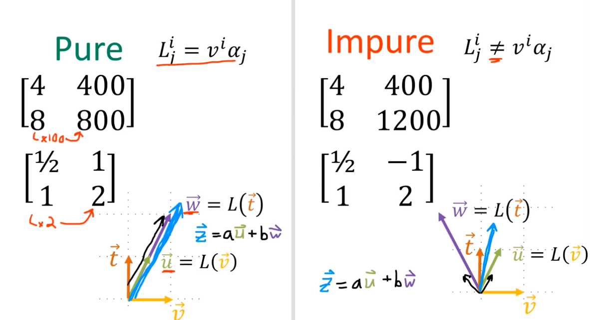

13、线性映射是向量-余向量对
===================================

一般线性映射可表示为

.. math::

   \{ \vec{e}_1 \epsilon^1, \vec{e}_1 \epsilon^2, \vec{e}_2 \epsilon^1, \vec{e}_2 \epsilon^2 \} \text{ is a basis for } \underline{V \rightarrow V}

.. math::

   {L} = a \vec{e}_1 \epsilon^1 + b \vec{e}_1 \epsilon^2 + c \vec{e}_2 \epsilon^1 + d \vec{e}_2 \epsilon^2

使用爱因斯坦求和约定得

.. math::

   L = L^i_j \vec{e}_i \epsilon^j

纯矩阵与非纯矩阵

\