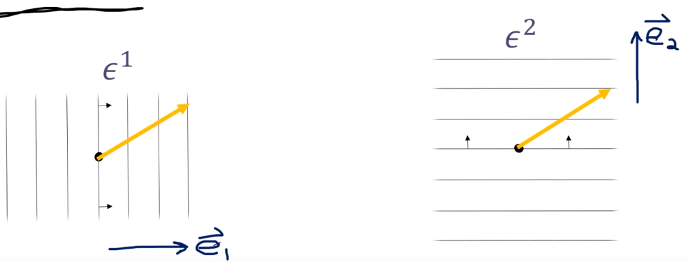
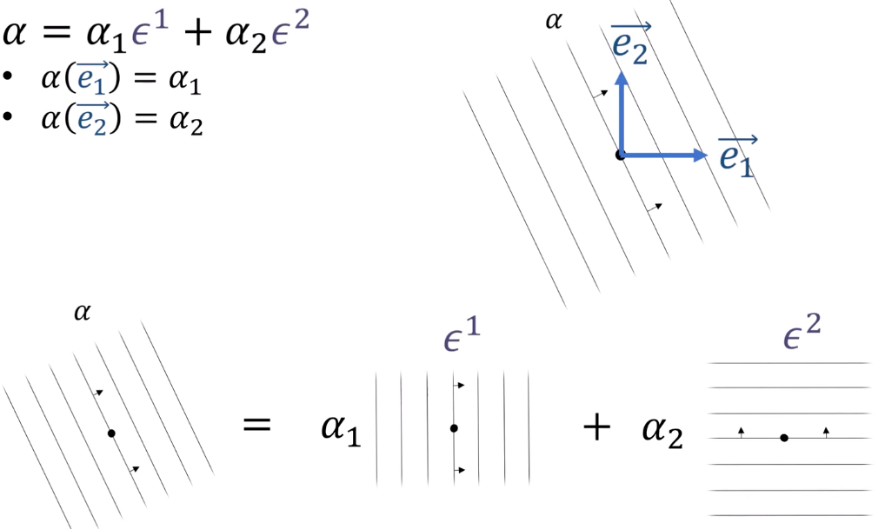
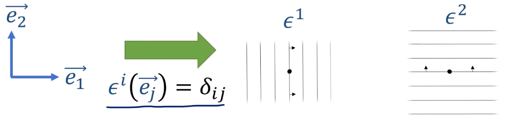
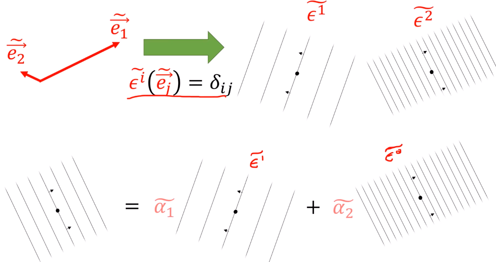
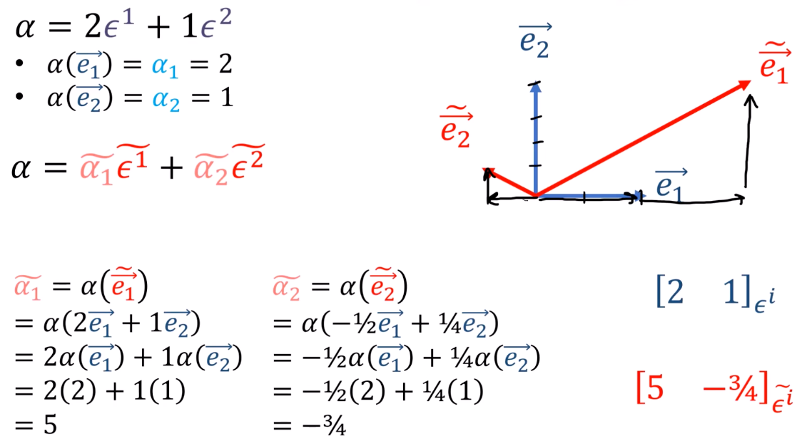
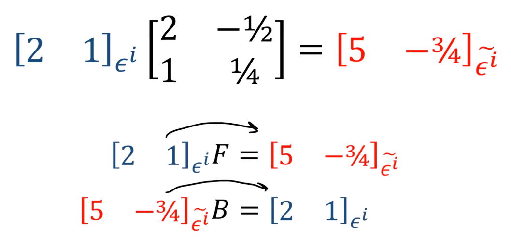

7、余向量分量
===================================

.. important::

   | 对偶向量和向量一样，是不变的，是纯粹的几何对象，不依赖于任何坐标系
   | 但对偶向量的分量确实是依赖于坐标系的

| 选取 :math:`V` 的两个基向量 :math:`\{ \vec{e_1}, \vec{e_2} \}` 
| 引入 **两个特殊的余向量** :math:`\epsilon^1, \epsilon^2: V \rightarrow \mathbb{R}`

- :math:`\epsilon^1(\vec{e_1}) = 1`   :math:`\epsilon^1(\vec{e_2}) = 0`
- :math:`\epsilon^2(\vec{e_1}) = 0`   :math:`\epsilon^2(\vec{e_2}) = 1`

| 上下标一样即为1，否则为0，
| 所以引入(克罗内克)Kronecker delta符号 :math:`\delta_{ij}` 来表示：

.. math::

   \epsilon^i(\vec{e_j}) = \delta_{ij} = \begin{cases} 1 & \text{if } i = j \\ 0 & \text{if } i \neq j \end{cases}

作用于一般向量 :math:`\textcolor{orange}{\vec{v}} = v^1 \vec{e_1} + v^2 \vec{e_2}` 上：

.. math::

   \epsilon^1(\textcolor{orange}{\vec{v}}) = \epsilon^1(v^1 \vec{e_1} + v^2 \vec{e_2}) = v^1 \epsilon^1(\vec{e_1}) + v^2 \epsilon^1(\vec{e_2}) = v^1

.. math::

   \epsilon^2(\textcolor{orange}{\vec{v}}) = \epsilon^2(v^1 \vec{e_1} + v^2 \vec{e_2}) = v^1 \epsilon^2(\vec{e_1}) + v^2 \epsilon^2(\vec{e_2}) = v^2

所以

.. math::

   \epsilon^i(\textcolor{orange}{\vec{v}}) = v^i

余向量 :math:`\epsilon` 的几何直观形态

.. math::

   \alpha = \alpha_1 \textcolor{purple}{\epsilon^1} + \alpha_2 \textcolor{purple}{\epsilon^2}

.. grid:: 2

   .. grid-item-card:: 向量展开
      :class-header: bg-primary text-white

      .. math::

         \vec{v} = v^i \vec{e_i}

      - 基向量 :math:`\vec{e_i}` 在下标
      - 分量 :math:`v^i` 在上标（逆变）

   .. grid-item-card:: 对偶向量展开
      :class-header: bg-success text-white

      .. math::

         \alpha = \alpha_i \epsilon^i

      - 对偶基 :math:`\epsilon^i` 在上标
      - 分量 :math:`\alpha_i` 在下标（协变）

对偶向量展开可视化

将任意余向量表示为对偶基的线性组合

   
推广到一般情况

   
| 指定一个旧余向量 :math:`\alpha = 2\epsilon^1 + 1\epsilon^2` 
| 如图为新旧对偶基

| 前向矩阵 :math:`F` 将其从旧基变换到新基
| 后向矩阵 :math:`B` 将其从新基变换到旧基

