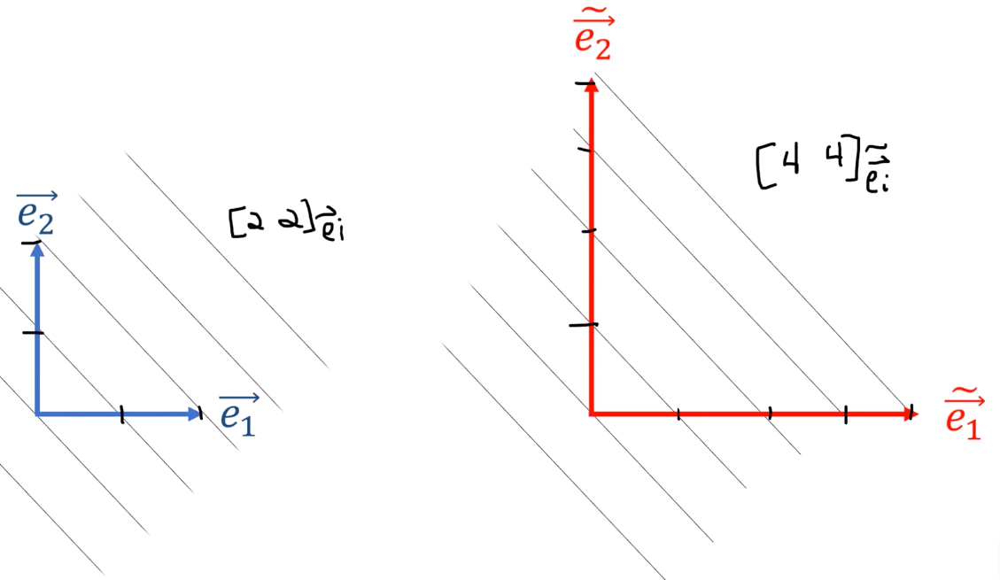

8、余向量变换规则
===================================

变换规则推导
-----------------------------------

余向量旧基变换为新基

旧基为 :math:`\epsilon^1` 和 :math:`\epsilon^2`，新基为 :math:`\widetilde{\epsilon^1}` 和 :math:`\widetilde{\epsilon^2}`，

.. math::

   \widetilde{\epsilon^1} = Q_{11}\epsilon^1 + Q_{12}\epsilon^2

   \widetilde{\epsilon^2} = Q_{21}\epsilon^1 + Q_{22}\epsilon^2

代入得

.. math::
    \widetilde{\epsilon^1}(\overrightarrow{e_1}) = 
    Q_{11}\epsilon^1(\overrightarrow{e_1}) + 
    Q_{12}\epsilon^2(\overrightarrow{e_1})

其中 :math:`\epsilon^1(\overrightarrow{e_1})=1`， :math:`\epsilon^2(\overrightarrow{e_2})=0`
所以得: :math:`\widetilde{\epsilon^1}(\overrightarrow{e_1})=Q_{11}`

.. image:: images/P8/8-1.png
   :scale: 50 %
   :alt: alternate text
   :align: center

所以得

.. math::
   \widetilde{\epsilon^1} = \widetilde{\epsilon^1}(\vec{e_1}) \epsilon^1 + \widetilde{\epsilon^1}(\vec{e_2}) \epsilon^2

.. note::

   | :math:`V^*` 为对偶空间
   | :math:`\{ \epsilon^j \}` 是 :math:`V^*` 的旧基。
   | :math:`\{ \widetilde{\epsilon^i} \}` 是 :math:`V^*` 的新基。

新旧对偶基定义：

.. grid:: 2

   .. grid-item-card:: 旧基定义
      :class-header: bg-primary text-white

      .. math::

         \epsilon^i(\vec{e_j}) = \delta_{ij}

      旧对偶基作用于旧基向量

   .. grid-item-card:: 新基定义
      :class-header: bg-danger text-white

      .. math::

         \widetilde{\epsilon^i}(\widetilde{\vec{e_j}}) = \delta_{ij}

      新对偶基作用于新基向量

| 正向变换 :math:`F` 和逆向变换 :math:`B`
| 正向变换和逆向变换是互逆的，即 :math:`F^{-1} = B`

.. math::

   \textcolor{red}{\widetilde{\vec{e_j}}} = \sum_{j=1}^{n} F_{ij} \textcolor{#3949AB}{\vec{e_i}}

.. math::

   \textcolor{#3949AB}{\vec{e_j}} = \sum_{j=1}^{n} B_{ij} \textcolor{red}{\widetilde{\vec{e_i}}}

.. math::

   \sum_j B_{ij} F_{jk} = \delta_{ik} (互逆性质)

| 使用逆向变换矩阵，从旧的对偶基转换到新的对偶基：
| 变换方式与基向量正好相反

.. grid:: 2

   .. grid-item-card:: 基向量 :math:`\vec{e}_i` （协变）
      :class-header: bg-success text-white
      :class-card: border-success

      正向变换（旧 → 新）

      .. math::

         \textcolor{red}{\widetilde{\vec{e}}_i} = \sum_{j=1}^{n} F_{ij} \textcolor{#3949AB}{\vec{e}_j}

      逆变换（新 → 旧）

      .. math::

         \textcolor{#3949AB}{\vec{e}_i} = \sum_{j=1}^{n} B_{ij} \textcolor{red}{\widetilde{\vec{e}}_j}

      +++

      :bdg-success:`协变` 与坐标变换同向，用 :math:`F_{ij}` 正向，:math:`B_{ij}` 逆向

   .. grid-item-card:: 对偶基 :math:`\epsilon^i` （逆变）
      :class-header: bg-primary text-white
      :class-card: border-primary

      正向变换（旧 → 新）

      .. math::

         \textcolor{red}{\widetilde{\epsilon}^i} = \sum_{j=1}^{n} B_{ij} \textcolor{#3949AB}{\epsilon^j}

      逆变换（新 → 旧）

      .. math::

         \textcolor{#3949AB}{\epsilon^i} = \sum_{j=1}^{n} F_{ij} \textcolor{red}{\widetilde{\epsilon}^j}

      +++

      :bdg-primary:`逆变` 与坐标变换反向，用 :math:`B_{ij}` 正向，:math:`F_{ij}` 逆向

.. important:: 变换规律

   |  **基向量** （协变）：:math:`F` 正向，:math:`B` 逆向
   |  **对偶基** （逆变）：:math:`B` 正向，:math:`F` 逆向

   即：**对偶基使用基向量的逆矩阵进行变换**

.. grid:: 2

   .. grid-item-card:: 向量分量 :math:`v^i` （逆变）
      :class-header: bg-primary text-white
      :class-card: border-primary

      旧分量 → 新分量

      .. math::

         \textcolor{red}{\widetilde{v}^i} = \sum_{j=1}^{n} B_{ij} \textcolor{blue}{v^j}

      新分量 → 旧分量

      .. math::

         \textcolor{blue}{v^i} = \sum_{j=1}^{n} F_{ij} \textcolor{red}{\widetilde{v}^j}

      +++

      :bdg-primary:`逆变` 指标在上，旧→新用 :math:`B=F^{-1}` （与基向量反向）

   .. grid-item-card:: 对偶向量分量 :math:`\alpha_i` （协变）
      :class-header: bg-success text-white
      :class-card: border-success

      旧分量 → 新分量

      .. math::

         \textcolor{red}{\widetilde{\alpha}_i} = \sum_{j=1}^{n} F_{ij} \textcolor{blue}{\alpha_j}

      新分量 → 旧分量

      .. math::

         \textcolor{blue}{\alpha_i} = \sum_{j=1}^{n} B_{ij} \textcolor{red}{\widetilde{\alpha}_j}

      +++

      :bdg-success:`协变` 指标在下，旧→新用 :math:`F` （与基向量同向）

变换规律总结
-----------------------------------

.. list-table:: 逆变 vs 协变
   :header-rows: 1
   :align: center

   * - 对象
     - 类型
     - 指标位置
     - 旧→新矩阵
     - 新→旧矩阵
   * - 基向量 :math:`\vec{e}_i`
     - 协变
     - 下标
     - :math:`F_{ij}`
     - :math:`B_{ij}`
   * - 向量分量 :math:`v^i`
     - 逆变
     - 上标
     - :math:`B_{ij}`
     - :math:`F_{ij}`
   * - 对偶基 :math:`\epsilon^i`
     - 逆变
     - 上标
     - :math:`B_{ij}`
     - :math:`F_{ij}`
   * - 对偶分量 :math:`\alpha_i`
     - 协变
     - 下标
     - :math:`F_{ij}`
     - :math:`B_{ij}`

.. important:: 核心规律

   | **"基协分逆，对偶相反"**
   |
   | 基向量（协变）↔ 其分量（逆变）
   | 对偶基（逆变）↔ 其分量（协变）
   |
   | 或者： **"上标逆，下标协"** （指分量的变换方式）
   | 但注意：基向量本身"下标协"，对偶基本身"上标逆"

逆变（Contravariant） 和 协变（Covariant） 
-----------------------------------------------------

| 核心思想：坐标变换时的"跟随"与"抵抗"
| **数学本质**：当坐标系变换时，分量如何变化以保持几何对象不变。

.. important:: 基向量 :math:`\vec{e}_i` 是协变的

   当坐标变换（比如拉伸）时，基向量 **跟随** 坐标系一起变。

   .. math::

      \widetilde{\vec{e}}_i = F_{ij} \vec{e}_j

   - 坐标系拉伸 2 倍 → 基向量也拉伸 2 倍
   - 这就是"协变"：**协同变化**

.. important:: 向量分量 :math:`v^i` 是逆变的

   为了保持向量 :math:`\vec{v}` 不变，分量必须 **反向** 变化。

   .. math::

      \widetilde{v}^i = B_{ij} v^j = (F^{-1})_{ij} v^j

   - 坐标系拉伸 2 倍 → 分量缩小 1/2
   - 这就是"逆变"：**反向变化**

.. important:: 对偶基 :math:`\epsilon^i` 是逆变的

   当坐标变换时，对偶基 **反向** 变化。

   .. math::

      \widetilde{\epsilon}^i = B_{ij} \epsilon^j = (F^{-1})_{ij} \epsilon^j

   - 坐标系拉伸 2 倍 → 对偶基缩小 1/2
   - 为什么？因为 :math:`\epsilon^i(\vec{e}_j) = \delta_{ij}` 必须保持为 1
   - 基向量 :math:`\vec{e}_j` 拉伸了 2 倍，对偶基必须缩小 1/2 才能"配对"成功

   这就是"逆变"： **反向变化** （与基向量相反）

.. important:: 对偶分量 :math:`\alpha_i` 是协变的

   为了保持对偶向量 :math:`\alpha` 不变，分量必须 **跟随** 坐标系变化。

   .. math::

      \widetilde{\alpha}_i = F_{ij} \alpha_j

   - 坐标系拉伸 2 倍 → 对偶分量也拉伸 2 倍
   - 这就是"协变"： **协同变化** （与对偶基相反，与基向量相同）

.. grid:: 2

   .. grid-item-card:: 速度向量（逆变）
      :class-header: bg-primary text-white

      想象你在开车：

      - 坐标系（地图）放大 2 倍
      - 你的速度 **数值** 要减半，才能表示同样的物理速度
      - 速度分量"抵抗"坐标变化

      .. math::

         \vec{v} = v^i \vec{e}_i \quad \text{（不变）}

      :math:`v^i` 逆变，:math:`\vec{e}_i` 协变

   .. grid-item-card:: 梯度（协变）
      :class-header: bg-success text-white

      想象温度场：

      - 坐标系（地图）放大 2 倍
      - 温度变化率 **数值** 也要放大 2 倍（因为距离单位变大了）
      - 梯度分量"跟随"坐标变化

      .. math::

         \nabla T = \frac{\partial T}{\partial x^i} \epsilon^i

      :math:`\frac{\partial T}{\partial x^i}` 协变，:math:`\epsilon^i` 逆变

